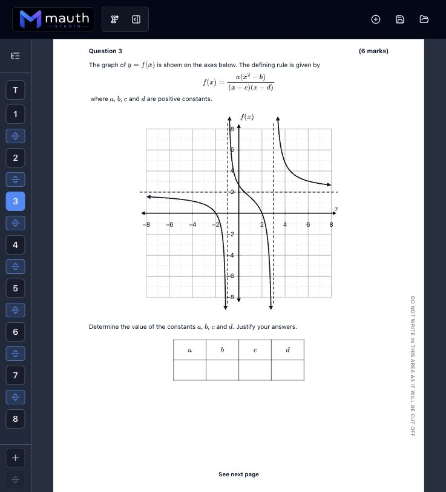

# Mauth Studio

Mauth Studio is a standalone, local-first macOS app for creating printable mathematics tests, exams, worksheets, notes, and solutions.

Teachers work in the Mauth Studio app. It includes the editor, A4 preview, files, validation, diagrams, solutions, and print workflow in one window, and starts its own local mathematics service without leaving Terminal windows open. Codex, Claude Code, Cursor, or another local agent can optionally connect through the authenticated local HTTP/MCP bridge to inspect and edit the live document.



## Development Status

Mauth Studio is alpha software. Expect active changes to app code, schemas, docs, tests, and agent workflows.

For a model or developer joining an existing worktree, `docs/current-state.md` is the authoritative handoff: it records the source checkpoint, runtime, storage warning, completed and active work, verification baseline, and exact resume point. Read it before starting or restarting services. Its **Documentation Ownership** table identifies which document owns each durable contract, so transient status, architecture, storage rules, and roadmap intent do not get mixed together.

For a model transition, read `AGENTS.md`, `docs/current-state.md`, and `docs/architecture.md` first. Then read only the subsystem guide named by the current resume point. Inspect and preserve any current uncommitted work unless the handoff explicitly says otherwise.

If you are new to Mauth, start with the public download page:

[davidjpramsay.github.io/mauth-studio](https://davidjpramsay.github.io/mauth-studio/)

The current public build supports Apple Silicon Macs and is alpha software. Downloading the signed app is enough for normal teacher use and for connecting Codex or Claude through the bundled Mauth Agent Connector. Clone the repository only when developing Mauth itself.

Recommended setup:

- `Mauth Development`: app code, architecture, schemas, tests, docs, CI, and repository maintenance.
- `Mauth Authoring`: creating, inspecting, converting, and polishing assessments through the app, bridge, MCP tools, or browser.

## What It Builds

- Printable maths tests, exams, and worksheets.
- Title pages, questions, parts, subparts, diagrams, tables, choices, working space, and solutions.
- MathJax SVG maths, JSXGraph diagrams, Penrose diagrams, and Plotly charts.
- Visible local document files in `~/Documents/Mauth/Documents` or another teacher-selected folder, with private app state in `~/Library/Application Support/Mauth Studio/storage` on macOS.
- Agent-readable snapshots, deterministic actions, validation, comments, suggestions, presence, and events.

## Agent-Native Workflow

Mauth avoids hidden UI state and raw JSON edits. The target loop is:

```text
mauth_snapshot
mauth_actions_preview
mauth_actions_apply
mauth_validation_run
rendered app verification
```

Agents should preview large edits before applying them. Successful applies go through the app action layer, editor history, autosave, and revision-aware project-file saves.

Example:

```text
1. Call mauth_snapshot.
2. Build a MauthDocumentAction batch.
3. Call mauth_actions_preview.
4. Apply the same batch with mauth_actions_apply.
5. Run mauth_validation_run.
6. Check the rendered preview in Mauth Studio.
```

## Install Mauth Studio

Mauth Studio 0.1.2 is the current downloadable updater-enabled alpha release:

[Download Mauth Studio 0.1.2](https://github.com/davidjpramsay/mauth-studio/releases/tag/v0.1.2)

Open the DMG under **Assets**, move **Mauth Studio** to Applications, then launch it from Finder, Spotlight, or the Dock. The app starts and stops its own local service. Python, Node.js, a repository checkout, and open Terminal windows are not required for ordinary use.

Version 0.1.0 predates the in-app updater, so those users must install a newer build manually once. Updater-enabled Mauth builds check the public alpha channel shortly after launch, ask before downloading, and ask again before restarting to install. You can also use **Mauth Studio > Check for Updates…**.

## Connect Codex Or Claude

Mauth Studio 0.1.2 includes a self-contained MCP connector. Keep the app in Applications, open it, then choose **Help > Set Up Codex or Claude…**. Copy the one-time Codex or Claude Code command, or merge the supplied `mauth` entry into Claude Desktop's Developer configuration. Keep Mauth Studio open while the agent is working.

The saved agent configuration points only to the signed connector inside the app. On each launch, that connector discovers the current dynamic local URL and private bridge token automatically; the token is not copied into prompts or configuration files. No source checkout, Node installation, or separate agent-files download is required. See `docs/agent-local-setup.md` and `docs/agent-bridge.md`.

## Develop From Source

Install dependencies from the project root:

```bash
pnpm install
cd apps/api
uv sync
cd ../..
```

Use the Electron development shell while changing the app:

```bash
pnpm macos:dev
```

The development shell starts watched FastAPI and Vite services on dynamic local ports. React and CSS edits update in the Electron window through Vite HMR, and API source edits trigger Uvicorn reloads. Restart `pnpm macos:dev` only after changing Electron main-process or packaging files. The installed standalone app remains a production build and receives source changes only through a deliberate install or published update.

For a deliberate local installed-app checkpoint:

```bash
pnpm macos:build
pnpm macos:install
```

This installs an ad-hoc-signed development build at `~/Applications/Mauth Studio.app`. It is not a shareable release.

Only versioned external releases use Developer ID signing and Apple notarization. Build a local release bundle with:

```bash
pnpm macos:release
```

The guarded end-to-end publication command is:

```bash
pnpm macos:ship
```

It requires a clean, pushed `main`, a new package version, matching release notes, Apple credentials, and GitHub authentication. It keeps the GitHub prerelease in draft until the signed DMG, signed ZIP, updater metadata, and blockmaps have uploaded and verified. Do not run either release command for routine edit-test cycles. See `docs/macos-release.md` for the complete contract.

The older browser launcher remains available for lower-level runtime debugging:

```bash
pnpm dev:launch:desktop
pnpm dev:status
pnpm dev:stop
```

Use `pnpm macos:install-launcher` only when testing the legacy Terminal-backed launcher. It is no longer the normal installed app.

For a deliberate clean browser-runtime restart, use:

```bash
pnpm dev:launch:replace
```

That command applies only to the legacy development launcher. The standalone app owns a dynamic loopback port and its child service lifecycle directly.

For lower-level debugging, start the API and web app in two terminals:

```bash
pnpm dev:api
pnpm dev:web
```

Open the web URL printed by the launcher or by `pnpm dev:web` (usually `http://localhost:5173`) only for lower-level browser debugging, then check the local bridge:

```bash
pnpm agent:doctor
pnpm smoke:agent-bridge
```

If Vite prints a different web URL, pass it to the doctor:

```bash
MAUTH_WEB_URL=http://127.0.0.1:5174 pnpm agent:doctor
```

Claude/Codex MCP clients can use:

```bash
pnpm agent:mcp
```

See `docs/current-state.md`, `docs/architecture.md`, `docs/agent-local-setup.md`, `docs/agent-bridge.md`, `docs/macos-release.md`, and `docs/index.html`.

## Repo Map

- `apps/api`: FastAPI services for maths, formatting, diagrams, storage, and project files.
- `apps/web`: Vite, React, TypeScript, Tailwind, MathJax SVG math rendering, JSXGraph, Penrose SVG rendering, and Plotly charts.
- `packages/question-engine`: JSON-configured question registry and Python plugins.
- `packages/marking-engine`: configurable marking rules and SymPy answer equivalence.
- `packages/formatting-engine`: configurable HTML and structured render blocks.
- `packages/shared`: TypeScript API contracts used by the web app.
- `packages/diagram-penrose`: Penrose Domain/Style files and JSON-to-Substance/SVG rendering for static geometric construction diagrams.
- `packages/diagram-plotly`: Plotly chart-spec adapter for statistics diagrams.
- `configs`: JSON rules for question types, formatting, marking, and AI-readable authoring brains.
- `workspace`: ignored local scratch space for generated artifacts.
- `chats`: starter prompts for the intended agent work streams.

## Agent Workflow

Use Mauth through the standalone app, local app APIs, MCP tools, and rendered app verification. The old provider-backed in-app chat panel is not the product path.

- Use the `Development` work stream for app code, schemas, tests, docs, CI, and repo maintenance.
- Use the `Authoring` work stream for creating, inspecting, converting, or polishing assessments.
- Keep these as separate chats where practical so code changes and assessment authoring do not get mixed together.
- Read `AGENTS.md`, `docs/current-state.md`, `docs/local-ai-workflow.md`, `docs/agent-bridge.md`, `docs/mauth-actions.md`, and `docs/ai-brains.md`.
- Read `docs/architecture.md` when changing process, state, storage, rendering, or package boundaries.
- Keep generated PDFs, crops, eval output, browser screenshots, and temporary scripts in `workspace/`.

Comments and suggestions are review state only. They do not mutate the document until an explicit action batch is previewed and applied.

## Verify

```bash
pnpm check
```

For a quick model-transition documentation audit without running the code suites:

```bash
pnpm check:handoff
```

Immediately before changing models, also compare the volatile checkpoint with the checkout:

```bash
pnpm check:handoff:live
```

This stricter transition check verifies the documented branch, baseline commit, dirty-worktree counts, and key source line counts. It is not part of the normal full gate because those values change during active implementation.

Useful narrower checks:

```bash
pnpm test:api
pnpm test:web-actions
pnpm build:web
```

With the API and web app running, useful smoke checks include:

```bash
pnpm smoke:file-manager
pnpm smoke:context-menu-actions
pnpm smoke:document-session-conflict
pnpm smoke:diagram-solution-authoring
pnpm smoke:diagram-gallery
```

## Mauthdown

Normal app documents use the `.mauth` extension. They are structured, versioned JSON files that preserve the full editor state and can be opened from Finder in an installed build. Mauthdown (`.mauth.md`) is the separate text authoring and interchange format: Markdown plus explicit containers for title pages, worksheet headings, questions, parts, subparts, text, choice lists, tables, diagrams, columns, spaces, and page breaks. See `docs/mauthdown.md`.

## Storage

Project files are visible `.mauth` teacher documents under `~/Documents/Mauth/Documents` by default or in another selected folder. Existing `.test.json` documents remain readable and retain their extension until deliberately renamed. On macOS, shared app state, autosave, reusable logos, and the remembered folder identity live under `~/Library/Application Support/Mauth Studio/storage`; project metadata and versions for an external selected folder remain in that folder's `.mauth` directory. Browser storage is only a fallback cache. Legacy repo-local `storage/` data is migration input or test data, not the normal save location. See `docs/storage.md`.

## Print

PDF output uses the browser print dialog and Save as PDF from the same A4 preview pages shown on screen. The app owns page content and page breaks; the browser owns physical paper output.
