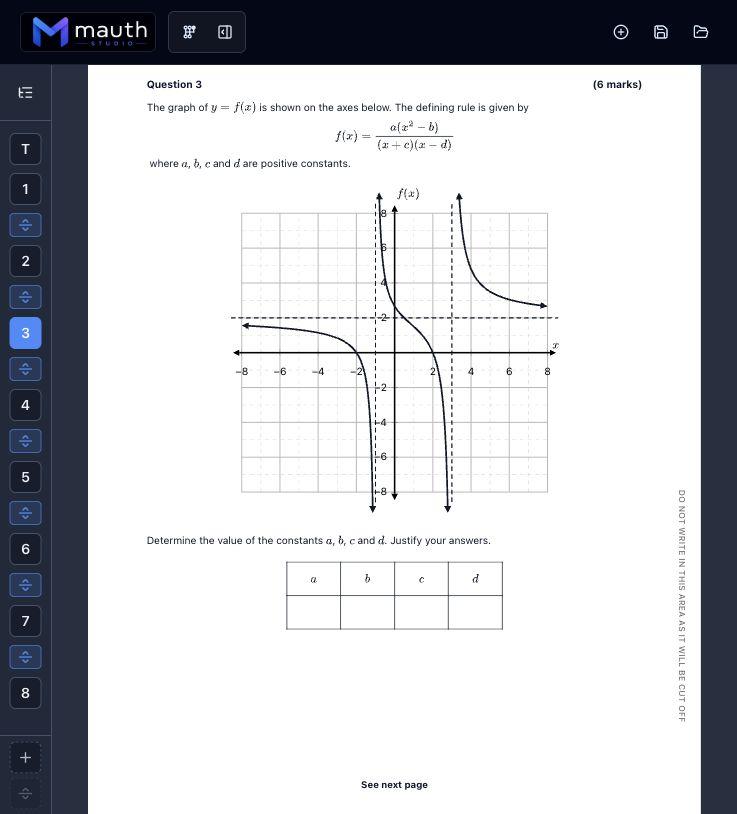

# Mauth Studio

Mauth Studio is a local-first macOS app for creating printable mathematics tests, exams, worksheets, notes, investigations, and solutions.



## Download

The current public build is the signed and Apple-notarized `0.1.3` alpha for Apple Silicon Macs.

[Download Mauth Studio 0.1.3](https://github.com/davidjpramsay/mauth-studio/releases/download/v0.1.3/Mauth-Studio-0.1.3-arm64.dmg)

Open the DMG, move **Mauth Studio** to Applications, and launch it normally. The app starts and stops its own local mathematics service. Python, Node.js, a repository checkout, and open Terminal windows are not required.

Mauth asks before downloading an update and again before restarting to install it. You can also choose **Mauth Studio > Check for Updates...**.

## What It Does

- Creates printable A4 assessments with title pages, sections, questions, parts, diagrams, tables, working space, and solutions.
- Supports tests, exams, worksheets, notes, and linked student/teacher investigation documents.
- Renders maths with MathJax SVG, coordinate diagrams with JSXGraph, geometry/set/network diagrams with Penrose, and statistics charts with Plotly.
- Keeps visible `.mauth` documents in a teacher-selected folder, with revision-aware saves, versions, autosave recovery, and multiple open tabs.
- Integrates with Finder through a Mauth document icon, thumbnail, and read-only Quick Look summary.

Mauth Studio is alpha software. Keep backups of important assessment files and expect the interface and schema to continue improving.

## Optional Codex Or Claude Connection

The app works without AI. To let Codex, Claude Code, or Claude Desktop inspect and edit the open Mauth document:

1. Open Mauth Studio.
2. Choose **Help > Set Up Codex or Claude...**.
3. Copy and run the one-time setup for your agent.
4. Keep Mauth Studio open while the agent is working.

No separate prompt, token, agent-files download, source checkout, or Node installation is required. MCP is the local connection that exposes structured Mauth tools to the agent. See [Connect Codex or Claude](docs/agent-local-setup.md).

The revision-safe authoring loop is:

```text
mauth_snapshot
mauth_actions_preview
mauth_actions_apply
mauth_validation_run
rendered Student and Solutions/Teacher verification
```

Snapshots include `activeDocumentId` and `openDocuments`, so agents can target the intended tab explicitly.

## Develop Mauth

A repository checkout is needed only to change the app itself.

Before editing, read:

1. `AGENTS.md`
2. `docs/current-state.md`
3. `docs/architecture.md`
4. the subsystem guide named by the current task

Install dependencies from the project root:

```bash
pnpm install
cd apps/api
uv sync
cd ../..
```

Run the watched Electron development app:

```bash
pnpm macos:dev
```

React/CSS edits use Vite HMR and API edits reload through Uvicorn. Restart `pnpm macos:dev` after Electron main-process, preload, startup, or packaging changes.

Use a deliberate local installed-app checkpoint only when needed:

```bash
pnpm macos:build
pnpm macos:install
```

That build is not a shareable release. External releases use the guarded process in `docs/macos-release.md`; `pnpm macos:release` and `pnpm macos:ship` are not routine development commands.

## Repository Map

- `apps/api`: FastAPI maths, storage, diagnostics, and agent bridge services.
- `apps/web`: React/Vite editor, preview, files, diagrams, solutions, and print UI.
- `packages/question-engine`: question generation.
- `packages/marking-engine`: marking rules and equivalence.
- `packages/formatting-engine`: formatting rules and render blocks.
- `packages/diagram-penrose`: Penrose diagram adapter.
- `packages/diagram-plotly`: Plotly statistics-chart adapter.
- `configs/ai-brains`: durable question, formatting, diagram, and solution authoring rules.
- `workspace`: ignored scratch space for PDFs, crops, screenshots, reports, and generated artifacts.

Normal teacher documents and private app state do not belong in Git. See `docs/storage.md`.

## Verification

Run the full repository gate before committing shared changes:

```bash
pnpm check
```

Useful focused checks:

```bash
pnpm test:api
pnpm test:web-actions
pnpm test:plotly
pnpm test:launcher
pnpm build:web
```

Use `pnpm check:handoff:live` only at a model/developer transition after the checkpoint in `docs/current-state.md` has been updated to match Git.

## Documentation

- `AGENTS.md`: agent rules and authoring conventions.
- `docs/current-state.md`: current handoff, verification baseline, and next work.
- `docs/architecture.md`: durable runtime and component boundaries.
- `docs/storage.md`: files, folders, autosave, versions, and recovery.
- `docs/agent-local-setup.md`: installed-app Codex/Claude setup.
- `docs/agent-bridge.md`: technical HTTP/MCP contract.
- `docs/mauth-actions.md`: structured mutation contract.
- `docs/mauthdown.md`: AI-friendly text interchange format.
- `docs/ai-brains.md`: focused authoring rule sets.
- `docs/macos-release.md`: signing, notarization, and publication.
