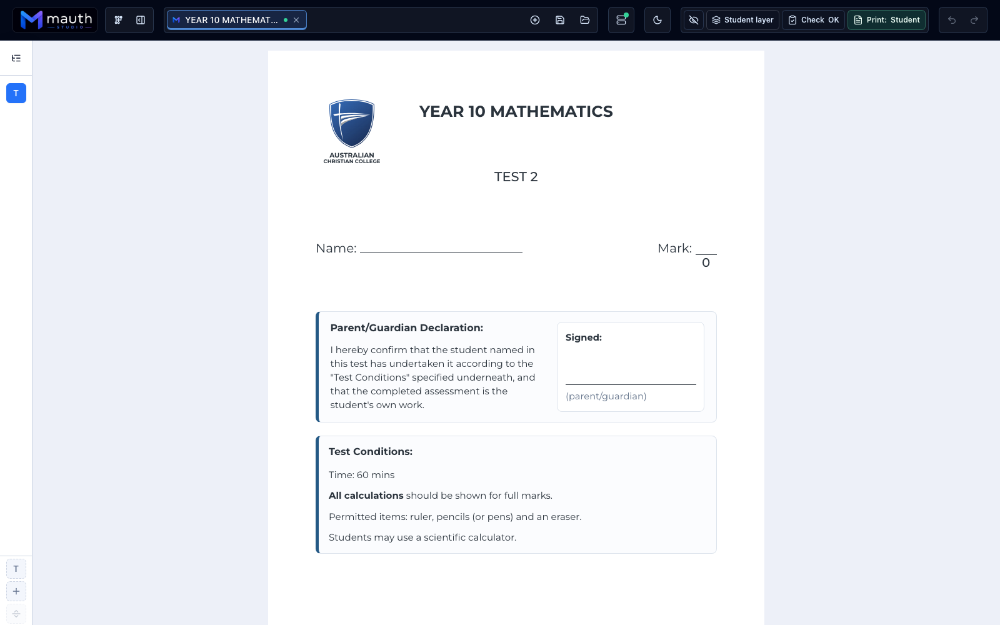

# Mauth Studio

Mauth Studio is a local-first macOS app for creating printable mathematics assessments and solutions.



## Download

[Download Mauth Studio 0.1.5 for Apple Silicon](https://github.com/davidjpramsay/mauth-studio/releases/download/v0.1.5/Mauth-Studio-0.1.5-arm64.dmg)

The current release is an alpha build signed and notarized by Apple. Open the DMG, drag **Mauth Studio** to Applications, and launch it normally. The app manages its own local services; Python, Node.js, and a repository checkout are not required.

Mauth Studio is still under active development. Keep backups of important documents.

## Features

- Tests, exams, worksheets, mathematics notes, investigations, and teacher solutions.
- Live A4 Student and Solutions previews with structured questions, marks, tables, diagrams, and working space.
- Mathematical typesetting with MathJax, graphs with JSXGraph, geometry with Penrose, and statistics charts with Plotly.
- Local `.mauth` files with autosave recovery, version history, revision-aware saves, and multiple document tabs.
- Finder document icons, Quick Look summaries, printing, and PDF export.

See the [Mauth Studio website](https://davidjpramsay.github.io/mauth-studio/) for screenshots and a feature overview.

## Optional Agent Help

Mauth works without AI. To connect Codex, Claude Code, or Claude Desktop:

1. Open Mauth Studio.
2. Choose **Help > Set Up Codex or Claude...**.
3. Run the one-time setup shown for your agent.

The agent can then create, inspect, edit, and validate documents through Mauth's local structured tools while you review the result in the app. See [Connect Codex or Claude](docs/agent-local-setup.md).

## Development

Read [AGENTS.md](AGENTS.md) and [docs/current-state.md](docs/current-state.md) before editing.

```bash
pnpm install
cd apps/api
uv sync
cd ../..
pnpm desktop:dev
```

Run the full quality gate before sharing changes:

```bash
pnpm check
```

Local installed-app builds use `pnpm macos:build` and `pnpm macos:install`. Public releases follow [docs/macos-release.md](docs/macos-release.md).

## Repository

- `apps/api`: FastAPI services, storage, diagnostics, and the agent bridge.
- `apps/web`: React editor, preview, files, diagrams, solutions, and print UI.
- `packages`: question, marking, formatting, and diagram engines.
- `configs`: question types, marking rules, formatting rules, and AI authoring guidance.
- `docs`: user setup, architecture, formats, release process, and GitHub Pages.
- `workspace`: ignored local scratch files and generated artifacts.

## Documentation

- [Current state](docs/current-state.md)
- [Architecture](docs/architecture.md)
- [Storage and recovery](docs/storage.md)
- [Agent setup](docs/agent-local-setup.md)
- [Agent bridge](docs/agent-bridge.md)
- [Structured actions](docs/mauth-actions.md)
- [Mauthdown format](docs/mauthdown.md)
- [Authoring rules](docs/ai-brains.md)
